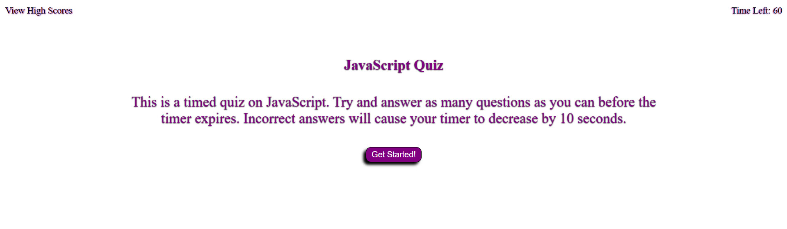

# JavaScript Quiz

This is a JavaScript Quiz using basic HTML, CSS, and JavaScript to manipulate the DOM.

## Rules
- You have a limited time to answer a series of questions on JavaScript basics.
- Each correct answer is worth 10 points.
- Each incorrect answer deducts 10 seconds from your timer.

## High Scores
- High scores are saved to localStorage.
- Can be displayed at any time by clicking "View High Scores"

## The JavaScript Quiz Page

A screenshot of the website:

A link to the live JavaScript Quiz: https://concord511.github.io/JSQ/